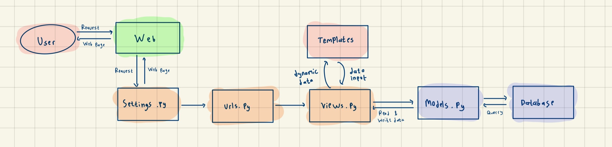

# README
Nama : Husin Hidayatu Hakim

NPM : 2306162222

Kelas : PBP C


## Tugas 2
### Step by step pembuatan Ngaji Kuy

1. Membuat direktori baru dengan nama `ngaji-kuy`.

2. Membuat dan mengaktifkan virtual environment pada direktori tersebut dengan:
    ```
    python -m venv env
    env\Scripts\activate
    ```

3. Membuat berkas reqirements berisikan :
    ```
    django
    gunicorn
    whitenoise
    psycopg2-binary
    requests
    urllib3
    ```
    dan menginstal dependencies tersebut dengan perintah `pip install -r requirements.txt`
4. Menginisiasi proyek django baru dengan perintah
`django-admin startproject ngaji-kuy .`

5. Membuat aplikasi baru bernama main dengan perintah
`python manage.py startapp main`

6. Membuat berkas template dalam main dan mengisinya dengan 
    ```
    <h1>Ngaji Kuy</h1>
    <h5>NPM: </h5>
    <p>{{ npm }}<p>
    <h5>Name: </h5>
    <p>{{ name }}<p>
    <h5>Class: </h5>
    <p>{{ class }}<p>
    ```
7. Membuat model product dengan memodifikasi berkas models.py dengan 
    ```
    from django.db import models

    class Quran(models.Model):
        name = models.CharField(max_length=255)
        price = models.IntegerField(default=0)
        description = models.TextField()
        stock = models.IntegerField(default=0) # stock quran yang tersedia
        publisher = models.CharField(max_length=255) # penerbit quran
        type = models.CharField(max_length=255) # jenis quran (quran tafsir atau quran terjemahan)
        discount = models.DecimalField(max_digits=5, decimal_places=2, default=0.00) # diskon quran
    ```
8. Menambahkan routing untuk menghubungkan `views.py` di `main` pada `urls.py`:
    ```python
    from django.urls import path
    from main.views import show_main

    app_name = 'main'

    urlpatterns = [ path('', show_main, name='show_main'),]
    ```
9. Mengkofigurasi routing url proyek dengan memodifikasi berkas urls.py dalam direktori ngaji_kuy dengan :
    ```
    urlpatterns = [
    ...
    path('', include('main.urls')),
    ...
    ]
    ```
10. Melakukan deployment pada PWS (Pacil Web Service).





### Fungsi git dalam pengembangan perangkat lunak
1. MMemungkinkan anggota tim bekerja pada proyek yang sama secara bersamaan tanpa saling mengganggu hasil kerja satu sama lain.

2. Melacak semua perubahan yang terjadi pada kode, termasuk detail seperti waktu perubahan dan identitas pengubahnya.

3. Menjadi tempat penyimpanan file atau product management, memudahkan penggunaan backup file.

4. Memudahkan deployment dengan adanya fungsi pull serta push.


### Alasan Django dijadikan sebagai framework pembelajaran
1. Menyediakan banyak fitur bawaan yang memudahkan pengembangan aplikasi web.
2. Menerapkan MVT (Model-View-Template) yang membantu pengembangan web yang terstruktur dan terorganisir.
3. Memiliki sistem keamanan yang solid untuk mengamankan aplikasi web. 

### Alasan model Django disebut sebagai ORM
Model di Django disebut ORM (Object-Relational Mapping) karena berperan sebagai perantara antara model objek di kode Python dan database relasional. Dengan ORM, aplikasi menjadi lebih portabel serta mendukung berbagai jenis relasi antar tabel di dalam database.


Nama : Husin Hidayatu Hakim

NPM : 2306162222

Kelas : PBP C

## Tugas 3

### Jelaskan mengapa kita memerlukan data delivery dalam pengimplementasian sebuah platform?

Data delivery telah menjadi tulang punggung yang dibutuhkan dalam pengimplementasian sebuah platform. Fungsinya sebagai penghubung yang memungkinkan berbagai komponen di dalam platform berinteraksi secara efisien dan harmonis, baik antara server dan klien maupun antar elemen seperti database dan user interface. Proses pengiriman data yang teratur, aman, dan tepat waktu menjamin kinerja platform berjalan sesuai harapan, menghindari isolasi antar elemen yang dapat mengganggu fungsionalitas. Selain itu, strategi data delivery yang tepat dapat meningkatkan skalabilitas platform, memungkinkannya untuk beradaptasi dengan perubahan kebutuhan dan mengatasi lonjakan beban data dengan cepat dan efisien.


### Menurutmu, mana yang lebih baik antara XML dan JSON? Mengapa JSON lebih populer dibandingkan XML?

- Lebih Ringkas: JSON menggunakan sintaks yang lebih sederhana dan lebih sedikit karakter dibandingkan XML, sehingga lebih cepat dikirim dan diproses.

- Mudah Diproses: JSON lebih mudah dipahami dan diurai oleh banyak bahasa pemrograman, terutama JavaScript.

- Struktur Sederhana: JSON hanya menggunakan pasangan kunci-nilai, sedangkan XML menggunakan tag yang lebih kompleks.

- Kinerja Lebih Efisien: JSON membutuhkan lebih sedikit sumber daya untuk parsing, sehingga lebih cepat dan efisien dibanding XML.

- Populer di API Modern: Banyak API dan aplikasi web serta mobile menggunakan JSON karena kompatibilitas dan kecepatan yang lebih baik.

### Jelaskan fungsi dari method `is_valid()` pada form Django dan mengapa kita membutuhkan method tersebut


Method `is_valid()` sangat penting dalam proses validasi data yang dimasukkan oleh pengguna pada form Django. Fungsinya adalah untuk memeriksa apakah data yang dikirimkan melalui form sudah sesuai dengan aturan validasi yang telah ditentukan, seperti apakah semua field wajib telah diisi, apakah format data benar, atau apakah data memenuhi batasan tertentu. Jika semua data valid, method ini akan mengembalikan `True`, dan jika ada yang tidak valid, akan mengembalikan `False`. Selain itu, jika terjadi kegagalan validasi, Django akan secara otomatis mengisi dictionary form.errors dengan pesan kesalahan untuk setiap field yang bermasalah. Method ini juga berperan penting dalam mencegah masuknya data yang tidak valid atau berbahaya, melindungi aplikasi dari bug dan potensi ancaman keamanan.

### Mengapa kita membutuhkan `csrf_token` saat membuat form di Django? Apa yang dapat terjadi jika kita tidak menambahkan `csrf_token` pada form Django? Bagaimana hal tersebut dapat dimanfaatkan oleh penyerang?

CSRF token (Cross-Site Request Forgery token) diperlukan saat membuat form di Django untuk melindungi aplikasi dari serangan CSRF. CSRF adalah jenis serangan di mana penyerang mencoba mengirim permintaan yang tidak sah atas nama pengguna yang telah diautentikasi di situs web. Token ini memastikan bahwa setiap permintaan yang dikirimkan oleh pengguna melalui form memang berasal dari sumber yang sah (situs web itu sendiri) dan bukan dari pihak eksternal.

Jika kita tidak menambahkan csrf_token pada form, aplikasi menjadi rentan terhadap serangan CSRF. Penyerang dapat memanfaatkan celah ini dengan mengirimkan permintaan berbahaya atas nama pengguna yang telah login tanpa sepengetahuan mereka, seperti melakukan transaksi atau mengubah data penting. Contohnya, jika pengguna mengakses halaman berbahaya yang dibuat oleh penyerang, halaman tersebut bisa secara otomatis mengirimkan permintaan ke server yang mengakibatkan perubahan data di akun pengguna tanpa izin.

Dengan menambahkan csrf_token, Django memastikan bahwa setiap permintaan form hanya bisa dijalankan jika token tersebut valid, sehingga melindungi aplikasi dari serangan yang mencoba memanfaatkan CSRF.

### Jelaskan bagaimana cara kamu mengimplementasikan checklist di atas secara step-by-step (bukan hanya sekadar mengikuti tutorial).

1. Membuat `base.html` untuk menjadi page utama dalam website
    ```python
    
    <!DOCTYPE html>
    <html lang="en">
        <head>
            <meta charset="UTF-8">
            <meta name="viewport" content="width=device-width, initial-scale=1.0">
             
        </head>
        <body>
             
        </body>
    </html>
    ```

    2. Menambahkan `BASE_DIR` pada `settings.py` agar project mengenali html yang akan menjadi template utama
    ```python
    'DIRS': [BASE_DIR / 'templates'],
    ```

    3. Menambahkan atribut `id` pada model product
    ```python
    from django.db import models
    import uuid

    class Quran(models.Model):
        id = models.UUIDField(primary_key=True,default=uuid.uuid4, editable=False)  
        name = models.CharField(max_length=255)
        price = models.IntegerField(default=0)
        description = models.TextField()    
        stock = models.IntegerField(default=2)
        publisher = models.CharField(max_length=255, default="No Publisher") # penerbit quran
        type = models.CharField(max_length=255, default="Tafsir") # jenis quran (quran tafsir atau quran terjemahan)
    

    @property
    def is_in_stock(self):
        return self.stock > 0
    ```

    4. Membuat `forms.py` untuk mendeklarasikan atribut-atribut dari model yang membutuhkan input dari user
    ```python
    from django.forms import ModelForm
    from main.models import Quran

    class QuranForm(ModelForm):
        class Meta:
            model = Quran
            fields = ["name", "price", "description", "publisher", "stock", "type"]
    ```

    5. Membuat method `create_name_entry` untuk mengambil input user sesuai dengan `forms.py`
    ```python
    def create_quran_entry(request):
        form = QuranForm(request.POST or None)

        if form.is_valid() and request.method == "POST":
            form.save()
            return redirect('main:show_main')

        context = {'form': form}
        return render(request, "create_quran_entry.html", context)
    ```

    6. Membuat method `show_main` untuk menampilkannya di `main.html`
    ```python
    def show_main(request):
    quran_entries = Quran.objects.all()
    context = {
        'Nama_Aplikasi' : "Ngaji Kuy",
        'Name' : "Husin Hidayatul Hakim",
        'Class' : "PBP C",
        'quran_entries': quran_entries
    }
    return render(request, "main.html", context)

    ```


    7. Membuat `show_xml`, `show_json`, `show_xml_by_id`, `show_json_by_id` untuk menampilkan response back dari input user
    ```python
    def show_xml(request):
        data = Quran.objects.all()
        return HttpResponse(serializers.serialize("xml", data), content_type="application/xml")


    def show_json(request):
        data = Quran.objects.all()
        return HttpResponse(serializers.serialize("json", data), content_type="application/json")

    def show_xml_by_id(request, id):
        data = Quran.objects.filter(pk=id)
        return HttpResponse(serializers.serialize("xml", data), content_type="application/xml")

    def show_json_by_id(request, id):
        data = Quran.objects.filter(pk=id)
        return HttpResponse(serializers.serialize("json", data), content_type="application/json")
    ```

    8. Melakukan routing di dari method yang sudah dibuat di `urls.py`
    ```python
    from django.urls import path
    from main.views import show_main, create_quran_entry, show_xml, show_json, show_xml_by_id, show_json_by_id

    app_name = 'main'

    urlpatterns = [
        path('', show_main, name='show_main'),
        path('create-mood-entry', create_quran_entry, name='create_mood_entry'),
        path('xml/', show_xml, name='show_xml'),
        path('json/', show_json, name='show_json'),
        path('xml/<str:id>/', show_xml_by_id, name='show_xml_by_id'),
        path('json/<str:id>/', show_json_by_id, name='show_json_by_id'),
    ]
    ```

    9. Membuat `create_name_entry.html` untuk tampilan ketika web ingin meminta input dari pengguna
    ```python
     
    
    <h1>Add Product Entry</h1>

    <form method="POST">
    
    <table>
        {{ form.as_table }}
        <tr>
        <td></td>
        <td>
            <input type="submit" value="Add Product Entry" />
        </td>
        </tr>
    </table>
    </form>

    
    ```
    
    10. Membuat `main.html` untuk menampilkan product dari hasil input pengguna
    ```python
    
    
    <h1>Ngaji Kuy</h1>

    <h5>Nama_Aplikasi: </h5>
    <p>{{ Nama_Aplikasi }}<p>

    <h5>Name:</h5>
    <p>{{ name }}</p>

    <h5>Class:</h5>
    <p>{{ class }}</p>

    
    <p>Belum ada data pemesanan pada ngaji kuy.</p>
    
    <table>
    <tr>
        <th>Nama Quran</th>
        <th>Price</th>
        <th>Description</th>
        <th>Publisher</th>
        <th>Stock</th>
        <th>Type</th>
    </tr>

    
    
    <tr>
        <td>{{quran_entry.name}}</td>
        <td>{{quran_entry.price}}</td>
        <td>{{quran_entry.description}}</td>
        <td>{{quran_entry.publisher}}</td>
        <td>{{quran_entry.stock}}</td>
        <td>{{quran_entry.type}}</td>
    </tr>
    
    </table>
    

    <br />

    <a href="">
    <button>Add New Mood Entry</button>
    </a>

    
    ```

### Screenshot Postman
#### JSON


#### XML
 

#### JSON with ID
 

#### XML with ID
